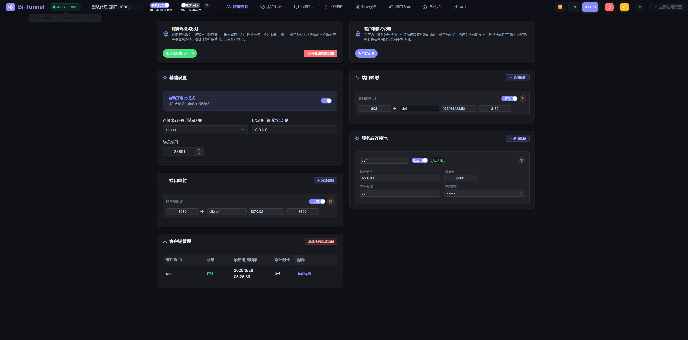
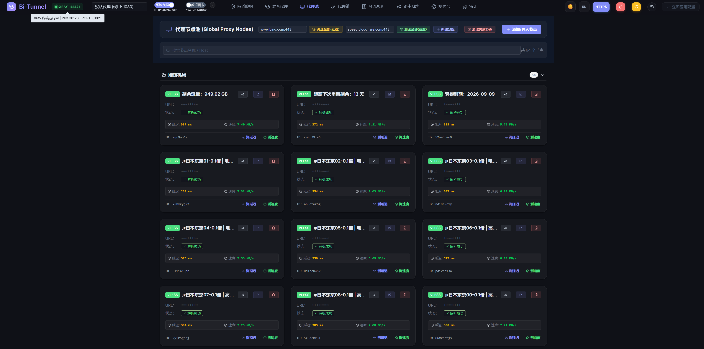
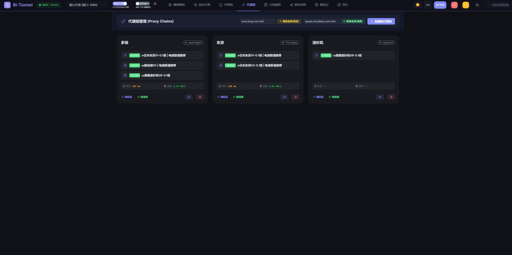
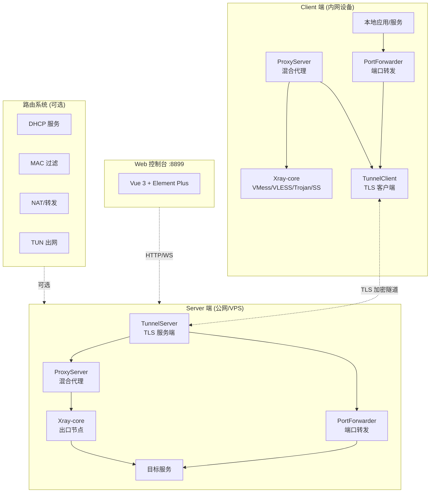
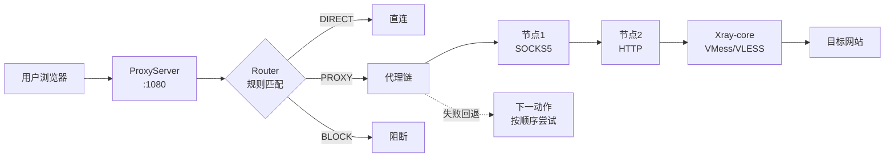
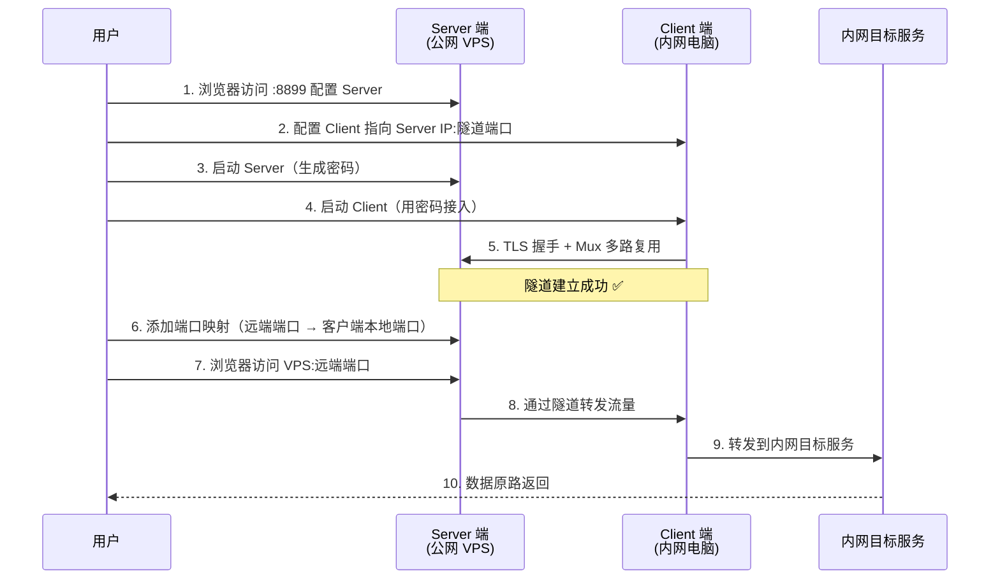
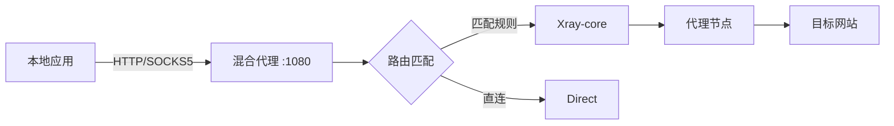

# Bi-Tunnel 双向内网穿透与高级代理工具

> [!NOTE]
> **License**: 本项目采用 **MIT License**（最宽松的开源协议之一），可自由使用、修改、分发、商业利用，仅需保留版权声明即可。
>
> 内置的 [Xray-core](https://github.com/XTLS/Xray-core) 遵循 MPL-2.0 协议，详见 [bin/LICENSE](bin/LICENSE)。

> [!CAUTION]
> **⚠️ 免责声明 (Disclaimer)**
>
> **仅供个人学习、合规测试使用**。请勿用于任何违反当地法律法规的用途。因使用本软件造成的任何后果，由使用者自行承担，作者概不负责。使用本软件即代表你同意本声明。

---

## 📸 Web 界面预览







---

## 🤔 项目简介

**Bi-Tunnel** 是一款 **双向内网穿透 + 混合代理 + 软路由** 三合一工具。

它通过 **1 个端口** 即可建立一条 TLS 加密的多路复用隧道，在隧道之上可承载无数个虚拟通道，把两台身处不同网络的电脑连成一个虚拟局域网，并实现：

- **双向通车**：A 能访问 B 的服务，B 也能访问 A 的服务
- **一口多用**：无论映射多少个服务，只占用 1 个外网端口
- **流量代理**：HTTP / SOCKS5 自动嗅探，支持 VMess / VLESS / Trojan / Shadowsocks 出口
- **智能分流**：基于通配符 / GeoIP / CIDR 的路由规则引擎
- **软路由模式**：把本机变成 LAN 网关，让局域网设备借道出网
- **Web 控制台**：Vue 3 + Element Plus 可视化管理一切

### 典型场景

- 在家远程办公，访问公司内网几十个系统（只用 1 个外网端口）
- A 电脑无网络，B 电脑有网络，二者相连后 A 借用 B 的网络上网
- 把一台 Linux VPS 变成软路由，让 LAN 设备走代理出网
- 在多个代理节点之间做测速、测延迟、链路串联测试

---

## ✨ 核心功能矩阵

| 模块 | 功能 | 说明 |
|------|------|------|
| 🚇 **隧道映射** | 双向端口转发 | 1 个隧道端口承载 N 个虚拟通道，互不干扰 |
| 🔀 **混合代理** | HTTP/SOCKS5 自动嗅探 | 同一端口同时支持两种协议 |
| 🌐 **代理池** | 多协议节点管理 | VMess / VLESS / Trojan / SS / HTTP / SOCKS5 |
| 🔗 **代理链** | 多节点串联 | 流量按顺序穿透多个节点 |
| 📋 **分流规则** | 通配符/GeoIP/CIDR | 规则卡片式管理，支持模板 |
| 🛰️ **路由系统** | 软路由 + DHCP | 给 LAN 设备分配 IP、走指定代理出网 |
| 🖧 **虚拟网卡** | TUN 全局代理 | Xray TUN 模式，接管全机流量 |
| 🖥️ **系统代理** | HTTP/SOCKS5 系统级 | 一键切换系统代理 |
| 📊 **流量审计** | 实时日志面板 | 模块/行为/目标多维度筛选 |
| 🧪 **测试台** | 节点/链路测速 | 真实下载测速 + TLS 延迟 |
| 🌍 **i18n** | 中英双语 | 一键切换语言 |
| 🎨 **主题** | 暗黑/明亮 | 一键切换 |
| 🔐 **认证** | HTTP Basic Auth | 控制台账号密码保护 |

---

## 🏗️ 系统架构



### 自研多路复用协议（Mux）

在单条 TLS 加密连接上，通过自定义帧协议承载**无数个虚拟通道**，每个通道独立传输数据，互不干扰。

```
帧格式: [1字节类型][4字节通道ID][4字节负载长度][N字节负载]

帧类型:
  TYPE_DATA     (1)  → 数据传输
  TYPE_CREATE   (2)  → 创建新通道
  TYPE_CLOSE    (3)  → 关闭通道
  TYPE_AUTH     (4)  → 认证请求
  TYPE_AUTH_RES (5)  → 认证响应
```

### 数据流转



---

## 📦 部署方式

### 平台支持矩阵

| 平台 | 支持 | 二进制 | Docker | 源码 |
|------|:---:|:---:|:---:|:---:|
| Windows x64 | ✅ | `bi-tunnel-win.exe` | ❌ | ✅ |
| Linux x64 | ✅ | `bi-tunnel-linux` | ✅ | ✅ |
| macOS | ⚠️ | 需自行编译 | ❌ | ✅ |

> **打包成品是单文件**：通过 [pkg](https://github.com/vercel/pkg) 把 Node.js 运行时 + 后端代码 + 前端静态资源 + bin 目录（含 `xray.exe`/`xray`/`wintun.dll`/`geoip.dat`/`geosite.dat` 等）全部嵌入到一个可执行文件里，无需安装 Node.js 即可直接运行。

---

### 🖥️ Windows 部署

**方式一：使用打包好的 exe（推荐，无需环境）**

1. 下载 `bi-tunnel-win.exe`
2. **右键 → 以管理员身份运行**（TUN 模式必须，其他模式可选）
3. 浏览器访问 `http://127.0.0.1:8899`
4. 默认账号：`admin` / 密码：`password`
5. 配置自动保存在 exe 同目录下的 `config.json`

**方式二：源码运行**

```bash
# 安装 Node.js v16+ 后
npm install
npm start
```

---

### 🐧 Linux 部署

**方式一：使用编译好的单文件**

```bash
chmod +x bi-tunnel-linux
sudo ./bi-tunnel-linux    # TUN/路由系统需要 root
```

生产环境建议配合 systemd：

```ini
# /etc/systemd/system/bi-tunnel.service
[Unit]
Description=Bi-Tunnel Service
After=network.target

[Service]
Type=simple
ExecStart=/path/to/bi-tunnel-linux
WorkingDirectory=/path/to/
Restart=always
User=root

[Install]
WantedBy=multi-user.target
```

```bash
systemctl enable --now bi-tunnel
```

**方式二：使用 Docker 容器化运行（推荐）**

```bash
# 构建镜像
git clone <repository_url>
cd bi-tunnel
docker build -t bi-tunnel .

# 启动容器（必须用 host 网络，否则端口映射失效）
docker run -d \
  --name bi-tunnel \
  --net host \
  --restart always \
  --privileged \
  bi-tunnel
```

> 注：TUN 模式和路由系统需要 `--privileged`，否则无法创建虚拟网卡 / 修改路由表。

---

### 💻 源码调试与编译

```bash
# 安装依赖
npm install

# 同时启动后端 + 前端开发服务器（前端热更新）
# 终端 1：后端
npm run dev:backend

# 终端 2：前端（默认 http://localhost:5173）
cd webui && npm install && npm run dev

# 打包成 Windows / Linux 单文件（输出在 dist/）
npm run build

# 仅构建前端
npm run build:webui

# 仅构建后端二进制
npm run build:app
```

> 跨平台打包建议在对应平台原生执行，或使用 Docker 跨平台构建。

---

## 🚀 快速上手

### 场景一：建立内网穿透隧道



**操作步骤**：

1. 在公网 VPS 上运行 Bi-Tunnel，进入 Web 控制台 → **隧道映射**
2. 在「服务端配置」设置：
   - 绑定 IP：`0.0.0.0`
   - 隧道端口：`33891`（自定义）
   - 连接密码：自动生成或手动填写
3. 启动服务端
4. 在内网电脑上运行 Bi-Tunnel，进入「客户端配置」：
   - 隧道主机：VPS 的 IP
   - 隧道端口：`33891`
   - 连接密码：与上面一致
5. 启动客户端，看到「已连接」即成功
6. 在服务端「端口映射」添加规则：远端 8080 → 客户端本地 80
7. 浏览器访问 `http://VPS-IP:8080` 即可访问内网的 80 端口服务

---

### 场景二：使用混合代理上网



1. 在「代理池」添加节点（支持 vmess://、vless://、trojan://、ss:// 链接批量导入）
2. 在「混合代理」创建代理卡片，选择端口和节点/代理链
3. 在顶部导航栏「选择活动代理」下拉框中选择该代理
4. 可选：开启「系统代理」（HTTP/SOCKS5）或「虚拟网卡」（TUN 全局）
5. 应用配置后即可使用

---

### 场景三：TUN 虚拟网卡全局代理

1. 在「混合代理」创建一个代理卡片
2. 在顶部选择该代理为活动代理
3. 点击「虚拟网卡」开关
4. 系统会自动启动 Xray TUN 模式，接管本机所有 TCP/UDP 流量
5. 私网段流量（10/172.16/192.168/127 等）自动绕过 TUN 直连

> Windows 需要 `wintun.dll`（已内置）+ 管理员权限
> Linux 需要 root + `/dev/net/tun`

---

### 场景四：把本机变成软路由

1. 进入「路由系统」页面
2. 选择网卡（推荐选非主上网网卡，或用 `0.0.0.0` 仅 DHCP 模式）
3. 设置网段（如 `192.168.88.1/24`）
4. 启用 DHCP，设置 IP 池
5. 选择「出网方式」：直连 / 系统代理 / TUN / 指定混合代理
6. 启动路由器
7. LAN 设备把网关指向本机 IP 即可借道出网

> ⚠️ 实验功能，暂未经过完整测试，请谨慎使用
> ⚠️ Windows 上绑定具体网卡会临时把 DHCP 切换为静态 IP，停止时自动恢复

---

## 🧩 核心模块说明

| 模块 | 文件 | 职责 |
|------|------|------|
| **MuxSession** | [src/core/multiplexer.js](src/core/multiplexer.js) | 多路复用会话管理，帧编解码，虚拟通道创建/销毁 |
| **TunnelServer** | [src/core/tunnelServer.js](src/core/tunnelServer.js) | TLS 服务端，监听端口，客户端认证，会话生命周期管理 |
| **TunnelClient** | [src/core/tunnelClient.js](src/core/tunnelClient.js) | TLS 客户端，支持多服务端连接，自动重连 (3s) |
| **PortForwarder** | [src/core/portForwarder.js](src/core/portForwarder.js) | 端口转发，支持正向/反向，热更新配置 |
| **ProxyServer** | [src/core/proxyServer.js](src/core/proxyServer.js) | 本地 HTTP/SOCKS5 代理，协议自动嗅探，ACL 控制 |
| **ProxyDialer** | [src/core/proxyDialer.js](src/core/proxyDialer.js) | 多级代理链拨号 (SOCKS5 → HTTP → V2Ray) |
| **Router** | [src/core/router.js](src/core/router.js) | 路由规则引擎 (通配符/GeoIP/IP 段匹配) |
| **XrayManager** | [src/core/xrayManager.js](src/core/xrayManager.js) | Xray-core 进程管理，VMess/VLESS 协议解析 |
| **RouterManager** | [src/core/routerManager.js](src/core/routerManager.js) | 软路由系统，DHCP/MAC 过滤/NAT/设备管理 |
| **TrafficLogger** | [src/utils/trafficLogger.js](src/utils/trafficLogger.js) | 流量审计日志，支持实时刷新与持久化 |
| **SystemProxy** | [src/utils/systemProxy.js](src/utils/systemProxy.js) | 系统级代理开关（Windows 注册表 / Linux gsettings） |
| **RouteManager** | [src/utils/routeManager.js](src/utils/routeManager.js) | 旁路路由管理（私网 IP 绕过 TUN） |

---

## ⚙️ 配置说明

所有配置通过 Web 控制台修改，自动保存到 `config.json`。

### 默认端口

| 用途 | 默认端口 |
|------|---------|
| Web 控制台 | 8899 |
| 隧道端口（Server） | 33891 |
| 混合代理 | 1080 / 1112 等 |
| 端口转发 | 8080 / 1111 等 |

### 默认账号

- 用户名：`admin`
- 密码：`password`

> 首次使用后请立即在控制台修改密码。

### Web 控制台访问协议

支持 HTTP 和 HTTPS 两种模式，可在顶部导航栏一键切换。HTTPS 模式使用自签名证书，浏览器会提示不安全，可忽略。

---

## 📊 流量审计

控制台「审计」页面提供实时流量监控：

- **多维度筛选**：模块（代理/隧道/转发）、行为（直连/代理/阻断）、目标地址、源 IP、匹配规则
- **实时刷新**：支持暂停/继续，避免刷屏
- **链路追踪**：显示每条请求经过的代理节点/代理链
- **耗时统计**：精确到毫秒的连接耗时
- **流量统计**：上行/下行字节数

---

## 🧪 代理测试

### 节点测速

- **延迟测试**：通过代理连 Google DNS (8.8.8.8:443) 完成 TLS 握手，测量真实国际链路延迟
- **速度测试**：从 `speed.cloudflare.com:443` 下载 5MB 文件，计算实际下载速度
- **批量测试**：支持「测速全部」按钮，可点击取消
- **可取消**：测试中再次点击按钮即取消

### 代理链测试

- 支持单链测试和「测速全部」
- 测试完整链路（依次穿透链中所有节点）
- 显示链路总延迟和预估速度

### 测试台

- 保存多组代理配置进行交叉测试
- 自定义测试 URL、超时、并发数
- 配置自动保存在浏览器中

---

## 🌍 国际化

支持中文和英文两种语言，顶部导航栏一键切换，语言偏好保存在浏览器本地。

---

## 🛠️ 开发指南

### 技术栈

- **后端**：Node.js + Express + WebSocket
- **前端**：Vue 3 + Element Plus + Tailwind CSS + Vite
- **代理引擎**：Xray-core (VMess / VLESS / Trojan / Shadowsocks)
- **打包**：pkg (Node.js → 单文件可执行)

### 项目结构

```
bi-tunnel/
├── bin/                       # Xray-core 二进制和资源
│   ├── xray.exe / xray        # Xray-core 主程序
│   ├── wxray.exe              # Windows TUN 专用
│   ├── wintun.dll             # Windows TUN 驱动
│   ├── geoip.dat / geosite.dat # GeoIP 数据库
│   └── tun-test.json          # TUN 配置样板（仅调试用）
├── src/
│   ├── index.js               # 应用入口
│   ├── config/config.js       # 配置管理
│   ├── core/                  # 核心模块
│   │   ├── multiplexer.js     # 多路复用协议
│   │   ├── tunnelServer.js    # 隧道服务端
│   │   ├── tunnelClient.js    # 隧道客户端
│   │   ├── portForwarder.js   # 端口转发
│   │   ├── proxyServer.js     # 混合代理
│   │   ├── proxyDialer.js     # 代理链拨号
│   │   ├── router.js          # 路由规则引擎
│   │   ├── xrayManager.js     # Xray 进程管理
│   │   └── routerManager.js   # 软路由系统
│   ├── utils/                 # 工具模块
│   │   ├── logger.js          # 日志
│   │   ├── systemProxy.js     # 系统代理
│   │   ├── routeManager.js    # 旁路路由
│   │   ├── tlsGenerator.js    # TLS 证书生成
│   │   ├── trafficLogger.js   # 流量审计
│   │   ├── xrayDownloader.js  # Xray 自动下载
│   │   ├── v2rayParser.js     # V2Ray 链接解析
│   │   └── macFilter.js       # MAC 地址过滤
│   └── web/
│       ├── api.js             # Web API 和 WebSocket
│       └── public/            # 前端构建产物
├── webui/                     # Vue 前端源码
│   └── src/
│       ├── App.vue            # 主组件
│       ├── i18n.js            # 国际化
│       ├── components/        # 通用组件
│       └── views/             # 页面视图
├── Dockerfile                 # Docker 构建
├── package.json               # 项目配置
└── README.md
```

### 开发命令

```bash
npm run dev:backend           # 启动后端（热重载需配合 nodemon）
npm run dev:webui             # 启动前端开发服务器（vite，热更新）
npm run build                 # 打包前后端
npm run build:webui           # 仅构建前端
npm run build:app             # 仅打包后端二进制
npm run build:css             # 构建 Tailwind CSS
```

---

## ⚠️ 注意事项

### 权限要求

- **Windows TUN 模式**：必须以管理员身份运行
- **Linux TUN 模式**：必须 root 或具备 `/dev/net/tun` 访问权限
- **路由系统**：必须 root/管理员（需要修改网卡和路由表）
- **系统代理**：普通权限即可

### 网络注意事项

- 启用 TUN 模式时，私网段（10/172.16/192.168/127/169.254/224 等）会自动绕过 TUN 直连
- 启用路由系统时，绑定的网卡在 Windows 上会临时从 DHCP 切换为静态 IP，停止时自动恢复
- Windows 路由系统会修改注册表 `IPEnableRouter`，停止时会自动恢复
- Docker 部署必须使用 `--net host`，否则端口映射和代理都会失效

### 已知限制

- 路由系统为实验功能，暂未经过完整测试
- macOS 暂无预编译二进制，需自行从源码编译
- Linux 上使用 `0.0.0.0` 网卡模式时，路由系统仅 DHCP/ARP 生效，不做 NAT/转发

### 故障排查

| 现象 | 可能原因 | 解决方法 |
|------|---------|---------|
| TUN 启动失败 | 非管理员权限 | 以管理员身份运行 |
| 路由器启动后断网 | 绑定了主上网网卡 | 改用 `0.0.0.0` 或非主网卡 |
| 系统代理下访问异常 | 路由系统残留注册表项 | 检查 `IPEnableRouter` 是否为 0 |
| DNS 验证超时 | TUN/代理拦截了 DNS 请求 | 关闭代理后重试，或使用系统 DNS |
| 端口冲突 | 端口已被占用 | 在控制台修改端口或停止冲突服务 |
| bin 目录有残留 config-*.json | 进程被强杀 | 可安全删除，或重启后端自动清理 |

---

## � License

本项目采用 **MIT License**。

```
MIT License

Copyright (c) 2026 Bi-Tunnel

Permission is hereby granted, free of charge, to any person obtaining a copy
of this software and associated documentation files (the "Software"), to deal
in the Software without restriction, including without limitation the rights
to use, copy, modify, merge, publish, distribute, sublicense, and/or sell
copies of the Software, and to permit persons to whom the Software is
furnished to do so, subject to the following conditions:

The above copyright notice and this permission notice shall be included in all
copies or substantial portions of the Software.

THE SOFTWARE IS PROVIDED "AS IS", WITHOUT WARRANTY OF ANY KIND, EXPRESS OR
IMPLIED, INCLUDING BUT NOT LIMITED TO THE WARRANTIES OF MERCHANTABILITY,
FITNESS FOR A PARTICULAR PURPOSE AND NONINFRINGEMENT. IN NO EVENT SHALL THE
AUTHORS OR COPYRIGHT HOLDERS BE LIABLE FOR ANY CLAIM, DAMAGES OR OTHER
LIABILITY, WHETHER IN AN ACTION OF CONTRACT, TORT OR OTHERWISE, ARISING FROM,
OUT OF OR IN CONNECTION WITH THE SOFTWARE OR THE USE OR OTHER DEALINGS IN THE
SOFTWARE.
```

### 第三方组件

| 组件 | 协议 |
|------|------|
| [Xray-core](https://github.com/XTLS/Xray-core) | MPL-2.0 |
| [Node.js](https://nodejs.org) | MIT |
| [Vue 3](https://vuejs.org) | MIT |
| [Element Plus](https://element-plus.org) | MIT |
| [Express](https://expressjs.com) | MIT |
| [Tailwind CSS](https://tailwindcss.com) | MIT |

---

## 🙏 致谢

- [XTLS/Xray-core](https://github.com/XTLS/Xray-core) — 强大的代理内核
- [Vue.js](https://vuejs.org) — 渐进式 JavaScript 框架
- [Element Plus](https://element-plus.org) — Vue 3 UI 组件库
- 所有开源贡献者

---

## ⭐ Star History

如果这个项目对你有帮助，欢迎 Star 支持！

[](https://starchart.cc/bi-tunnel)
