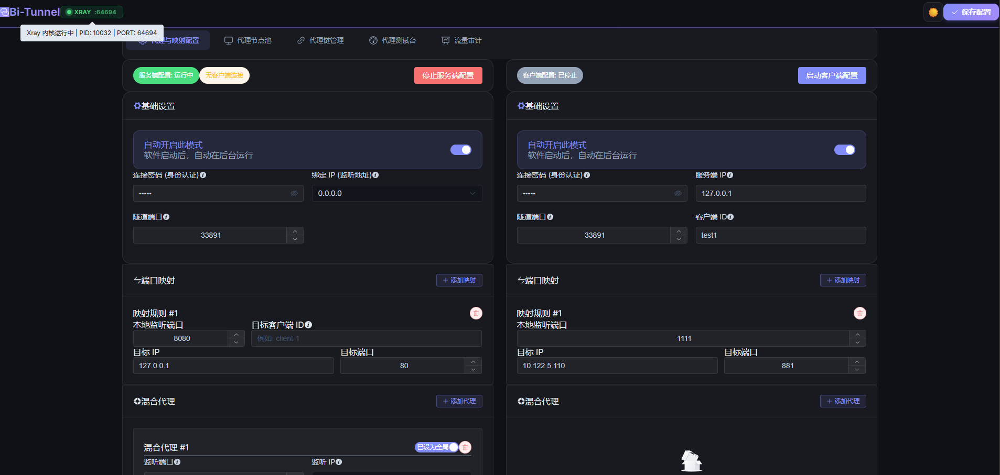

# Bi-Tunnel 双向内网穿透与高级代理工具

> [!CAUTION]
> **⚠️ 免责声明 (Disclaimer)**
>
> **仅供个人学习、合规测试使用**。千万别拿去干坏事（网络安全不容小觑）。如果因为你瞎折腾惹上官司或造成损失，**所有责任你自己背**，我概不负责。使用本软件即代表你同意本声明。

## Web界面




## 🤔 为什么要做这个？

想象一下：你在家里，想访问公司内网的电脑，但公司防火墙管得死死的，或者压根没有公网IP。传统的穿透工具配置麻烦，而且你要访问10个服务，可能就得开10个外网端口。

**Bi-Tunnel 就是为了解决这个痛点！**
不管你需要访问多少个服务，它**只需要占用1个端口**！通过这1个通道，你能建无数个小通道，把家和公司连成一个局域网，想怎么访问就怎么访问。而且，你不仅可以连过去，对面的电脑也可以反过来连你（双向通车）！

前提是`A内网设备`拥有一个能被`B设备`访问的端口,比如先使用公司的内网软件VPN之类的建立隧道连接,接入内网后,一般公司会开放3389给远程,这时候就可以使用3389建立隧道,但是得先关闭远程桌面,让内网通过vpn的包裹下,反向通过B设备上网,B设备也能通过A设备上网,实现双赢

## 🚀 这东西能干嘛？

简单来说，这是一个 **“一根网线走天下”** 的网络神器。

1. **内网穿透**：只用1个端口，把内网里的上百个网页、数据库、远程桌面全映射出来。
2. **在家办公**：坐在家里的沙发上，无缝连接公司内网的系统。
3. **网络共享与代理转发**：A电脑不能上网，B电脑能上网。用它连起来，A电脑就能借用B电脑的网络去上网（全局代理）。
4. **灵活的国内外分流 (GeoIP)**：内置了 IP 归属地判断模块。您可以轻松设定“国内 IP 直连”、“非国内 IP 走公司代理”、“YouTube / GitHub / HuggingFace 走高速节点”。一切全自动智能分流。
5. **详细的流量审计**：提供了实时的流量监控控制台。精确告诉你：你的请求发到了哪里？走了哪条代理链？耗时多少？传输了多少字节？一目了然！
6. **超级安全隐蔽**：所有的数据都被打包加密在一条长连接里，外面的防火墙根本看不出你里面跑了什么流量，而且还带密码认证。

## ✨ 核心特色功能

*   **⚡ 一口多用 (黑科技)**
    底层跑的是全自主研发的通信协议。不管是发网页、传文件还是远程控制，全挤在一条隧道里跑，互不干扰。
*   **🔄 双核并行 (双开模式)**
    一个软件，既能当“服务端”接收连接，又能当“客户端”主动连接别人。两边配置各自独立，一台电脑上可以同时双开跑两条互不干扰的高速公路！
*   **🛡️ 智能混合代理与路由匹配**
    不需要你操心用什么代理协议，随便填一个本地端口，网页 HTTP 还是 SOCKS5 流量它都能自动识别！支持通配符、内网段 (`192.168.*.*`) 以及 GeoIP (`geoip:cn`) 等多种匹配规则，可下拉预设，也可手动自建。
*   **📈 超好看的网页控制台与实时审计**
    抛弃复杂的黑框框命令行！自带了一个非常漂亮的网页控制台，可管理代理池、配置代理链、一键测速，还支持多维度条件搜索（模块、行为、目标地址）的流量审计面板。
*   **📦 多平台支持，即点即用**
    提供 Windows / Linux 各平台独立版，甚至支持轻量级 Docker 容器部署！

## 🛠️ 怎么部署？

### 🖥️ Windows 部署
**最简单的方式（无需环境）**：
1. 下载打包好的 `bi-tunnel-win.exe` (或使用源码 `npm run build` 生成的二进制)。
2. 双击运行。
3. 打开浏览器访问 `http://127.0.0.1:8899` (默认账号 admin，密码 password) 即可进入控制台。配置会自动保存在同目录下的 `config.json` 里。

### 🐧 Linux 部署
**方法一：使用编译好的单文件**
1. 下载打包好的 `bi-tunnel-linux`。
2. 赋予执行权限：`chmod +x bi-tunnel-linux`
3. 运行：`./bi-tunnel-linux`
*(如果是生产环境，建议配合 systemd 守护进程运行)*

**方法二：使用 Docker 容器化运行 (推荐)**
为了保证网络互通和最小化配置，推荐使用 `--net host` 模式跑容器：

```bash
# 1. 克隆代码并构建镜像
git clone <repository_url>
cd bi-tunnel
docker build -t bi-tunnel .

# 2. 启动容器 (使用 host 网络，以便直接映射本地端口)
docker run -d \
  --name bi-tunnel \
  --net host \
  --restart always \
  bi-tunnel
```
*注：由于使用了 host 网络，您不需要额外使用 `-p` 映射端口。控制台将直接监听 `8899` 端口，各种代理端口（如 1080）也直接暴露在主机网络。*

### 💻 源码调试与编译 (给程序员看的)
如果你想改代码，请装好 Node.js (v16+)：

```bash
# 安装依赖
npm install

# 运行测试
npm start

# 打包成 Windows 和 Linux 的单独执行文件 (输出在 dist 目录下)
npm run build
```


```待实现
服务端代理不能输入ip的问题待修复,代理链样式的问题,还有某个域名需要能转发多个代理链,一个不通走另一个,负载均衡,还有要能支持导入订阅链接,手动勾选导入的代理,和规则
```